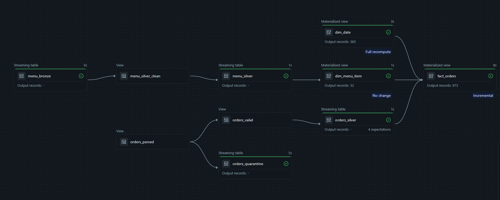
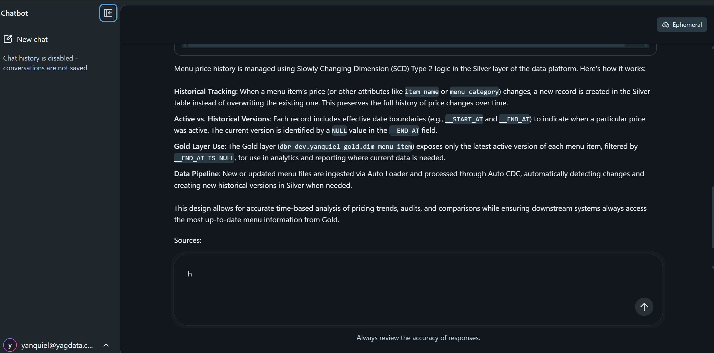
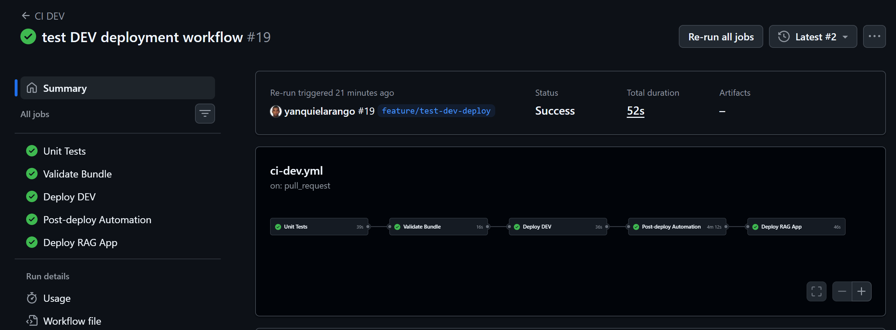

# Data Platform

End-to-end data platform built on Databricks, combining batch and streaming ingestion, Lakehouse processing, data quality, reconciliation, automation, CI/CD, and a RAG assistant powered by Databricks AI Search.

The project brings together the main concepts covered in Labs 8, 9, 11, and 12 and applies them as a single integrated solution rather than as separate exercises.

---

## Overview

The goal of this project is to build and automate a complete data platform on Databricks.

The platform processes two different types of data:

- Order events ingested in near real time through Databricks Zerobus.
- Menu data ingested from CSV files using Auto Loader.

The data is processed through Bronze, Silver, and Gold layers using a Lakeflow pipeline. Data quality checks and reconciliation are executed after the pipeline to verify the resulting datasets.

The project also includes a custom RAG assistant that uses the project documentation as its knowledge base. Databricks AI Search retrieves the relevant documentation and a custom agent uses that context to answer questions through a Databricks App.

Infrastructure and Databricks resources are managed through Databricks Asset Bundles, while GitHub Actions handles validation, DEV deployment, post-deployment checks, and deployment of the RAG application.

---

## Architecture

The solution is divided into three main areas:

1. Data ingestion and Lakehouse processing.
2. Data quality and operational validation.
3. Retrieval-Augmented Generation and conversational access.

### Data Platform

```text
                           DATA SOURCES

                  ┌──────────────┴──────────────┐
                  │                             │
             Order Events                  Menu Files
                  │                             │
               Zerobus                   CSV / Auto Loader
                  │                             │
                  └──────────────┬──────────────┘
                                 │
                                 ▼
                              BRONZE
                        Raw ingested data
                                 │
                                 ▼
                         LAKEFLOW PIPELINE
                                 │
                                 ▼
                              SILVER
                    Validation and processing
                    ├── Data validation
                    ├── Order deduplication
                    ├── Quarantine
                    └── Menu SCD Type 2
                                 │
                                 ▼
                               GOLD
                      Business-ready datasets
                                 │
                      ┌──────────┴──────────┐
                      │                     │
                     DQX             Reconciliation
                      │                     │
                      └──────────┬──────────┘
                                 │
                                 ▼
                         Validated platform
```

### RAG

```text
                     PROJECT DOCUMENTATION
                              Markdown
                                 │
                                 ▼
                              Chunking
                                 │
                                 ▼
                          rag_documents
                            Delta table
                                 │
                                 ▼
                       Databricks AI Search
                                 │
                                 ▼
                               MCP
                                 │
                                 ▼
                         Custom RAG Agent
                                 │
                                 ▼
            databricks-qwen3-next-80b-a3b-instruct
                                 │
                                 ▼
                         Databricks App
                                 │
                                 ▼
                         Conversational UI
```

---

## Data Ingestion

The project uses two ingestion patterns to represent streaming and file-based workloads.

### Orders

Orders are ingested as streaming events using Databricks Zerobus.

A local Python producer sends order events to the Zerobus ingestion endpoint, which writes the events into the Bronze orders table in Unity Catalog.

```text
Python Producer
      │
      ▼
Databricks Zerobus
      │
      ▼
dbr_dev.yanquiel_bronze.orders_bronze
```

The Bronze layer preserves the incoming events before Silver processing is applied.

The streaming infrastructure is also integrated into the deployment workflow. Before the pipeline is executed, the CI/CD process checks whether the Bronze streaming table exists.

If the table already exists, the setup step is skipped. If it does not exist, the setup job creates the required streaming resources.

This makes the setup operation idempotent and avoids recreating the Bronze streaming table during every deployment.

### Menu

Menu data follows a file-based ingestion pattern.

CSV files are stored in a Unity Catalog Volume and processed with Databricks Auto Loader.

```text
CSV files
    │
    ▼
Unity Catalog Volume
    │
    ▼
Auto Loader
    │
    ▼
menu_bronze
```

The ingestion process also keeps metadata such as:

- source file name;
- ingestion timestamp;
- corrupt record information when applicable.

This metadata can be used for traceability and troubleshooting.

---

## Lakehouse Processing

The platform follows the Medallion Architecture with Bronze, Silver, and Gold layers.

### Bronze

The Bronze layer contains the raw data received from the ingestion processes.

Its purpose is to preserve source data before validation and business transformations are applied.

Main Bronze datasets include:

```text
dbr_dev.yanquiel_bronze.orders_bronze
dbr_dev.yanquiel_bronze.menu_bronze
```

Orders arrive through Zerobus, while menu data is loaded from files through Auto Loader.

### Silver

The Silver layer contains validated and processed data.

For orders, the transformation includes:

- required-field validation;
- event-time processing;
- one-day watermarking;
- deduplication using `order_details_id`;
- routing of invalid records to quarantine.

Bronze keeps the original incoming events, while Silver provides the valid deduplicated representation used by downstream processing.

Duplicates are removed from Silver rather than being treated as invalid records.

For menu data, the platform uses SCD Type 2 to preserve price history.

Auto CDC manages the different versions of each menu item. Historical validity is represented using:

```text
__START_AT
__END_AT
```

This means that previous menu prices remain available in Silver instead of being overwritten.

### Gold

The Gold layer contains business-ready datasets.

For menu items, the Gold dimension exposes only the current SCD Type 2 version:

```text
__END_AT IS NULL
```

Historical versions remain available in Silver.

Gold is also the final layer used by the reconciliation process to verify that the results produced by the pipeline are consistent with the processed Silver data.

---

## Lakeflow Pipeline

The transformations are orchestrated through a Databricks Lakeflow pipeline.

The pipeline processes Bronze data, applies the Silver transformations, and creates the Gold datasets.

Pipeline configuration is deployed as part of the Databricks Asset Bundle, keeping the resource definition together with the source code.

### Final Pipeline Run

The following graph shows the Lakeflow pipeline after a successful execution.



---

## Data Quality

Data quality checks are implemented using Databricks Labs DQX.

The checks run after the Lakeflow pipeline and validate the processed datasets against the quality rules defined by the project.

```text
Lakeflow Pipeline
       │
       ▼
      DQX
       │
       ├── Valid records
       │
       └── Invalid records / quality failures
```

DQX is integrated into the CI/CD workflow rather than being executed as a separate manual validation step.

If the quality checks fail, the corresponding GitHub Actions step fails as well.

This makes data quality part of the deployment process.

---

## Reconciliation

Data quality rules validate individual records, but they do not by themselves guarantee that the relationship between processing layers is correct.

For that reason, the project also performs reconciliation between Silver and Gold.

For orders, the current reconciliation verifies:

```text
Silver order count
        │
        ├──────────► Gold order count
        │
        └──────────► Gold SUM(quantity)
```

The reconciliation script exits with an error if the expected relationships are not satisfied.

This provides an additional validation layer after the Lakeflow pipeline has completed.

---

## RAG Assistant

The project includes a custom Retrieval-Augmented Generation assistant for exploring the Data Platform documentation.

The goal is to allow users to ask questions about the implementation without requiring the language model to rely only on its general knowledge.

The current knowledge base contains Markdown documentation for the main parts of the platform:

```text
knowledge/
├── data_platform.md
├── menu_and_pricing.md
└── order_processing.md
```

The documentation covers areas such as:

- platform architecture;
- order ingestion;
- Zerobus;
- validation and deduplication;
- menu ingestion;
- menu price history;
- Silver and Gold processing.

---

## Document Processing

Before the documentation can be searched, it is transformed into smaller chunks.

```text
Markdown documents
        │
        ▼
Document loading
        │
        ▼
Markdown-aware chunking
        │
        ▼
Delta table
```

The resulting chunks are stored in:

```text
dbr_dev.yanquiel_silver.rag_documents
```

Each chunk keeps metadata that allows the retrieved content to be traced back to its original document.

Change Data Feed is enabled on the Delta table so that it can be used by the AI Search synchronization process.

---

## Databricks AI Search

Databricks AI Search provides the retrieval layer for the RAG implementation.

The project uses the following index:

```text
dbr_dev.yanquiel_silver.rag_documents_index
```

The index is built from:

```text
dbr_dev.yanquiel_silver.rag_documents
```

The document chunk content is used as the embedding source.

The embedding model is:

```text
databricks-qwen3-embedding-0-6b
```

The retrieval process works as follows:

```text
User question
      │
      ▼
Databricks AI Search
      │
      ▼
Relevant documentation chunks
      │
      ▼
Agent context
```

Only the relevant chunks are returned for each question instead of passing the entire knowledge base to the language model.

---

## Custom RAG Agent

The conversational layer is implemented as a custom agent running inside a Databricks App.

The agent accesses the AI Search index through Databricks MCP.

For project-related questions, the agent is configured to retrieve information from AI Search before generating an answer.

```text
User
 │
 ▼
Custom Agent
 │
 ▼
AI Search MCP
 │
 ▼
rag_documents_index
 │
 ▼
Relevant chunks
 │
 ▼
Qwen
 │
 ▼
Grounded answer
```

The Foundation Model used by the application is:

```text
databricks-qwen3-next-80b-a3b-instruct
```

The agent is instructed to base project-related answers on the retrieved documentation and avoid inventing implementation details that are not supported by the knowledge base.

If the available documentation does not contain enough information, the agent is expected to state that instead of generating an unsupported answer.

The response also includes the names of the documentation files actually used.

For example:

```text
Question:
How does menu price history work?

        │
        ▼

AI Search retrieves relevant chunks
from menu_and_pricing.md

        │
        ▼

Qwen generates the grounded response

        │
        ▼

Sources:
- menu_and_pricing.md
```

---

## Databricks App

The RAG assistant is exposed through a Databricks App:

```text
agent-data-platform-rag-v2
```

The application provides a conversational interface where users can ask questions about the Data Platform.

The application uses:

- a custom Python agent;
- Databricks AI Search;
- MCP;
- a Databricks Foundation Model;
- MLflow tracing;
- Databricks Apps as the user interface.

### RAG Assistant

The following example shows the assistant answering a question using the indexed project documentation.



The source displayed in the response comes from the documentation retrieved for that question.

---

## CI/CD

CI/CD is implemented with GitHub Actions.

A pull request targeting `main` triggers the DEV workflow.

```text
Pull Request → main
        │
        ▼
    Unit Tests
        │
        ▼
  Validate Bundle
        │
        ▼
    Deploy DEV
        │
        ▼
Post-deploy Automation
        │
        ├── Check streaming infrastructure
        ├── Run setup when required
        ├── Trigger Lakeflow pipeline
        ├── Run DQX
        ├── Run reconciliation
        └── Run platform automation check
        │
        ▼
   Deploy RAG App
        │
        ├── Sync application source
        └── Deploy Databricks App
```

The workflow is intentionally sequential. A failed stage prevents the dependent deployment stages from continuing.

### Authentication

GitHub Actions authenticates with Azure using OIDC.

The GitHub service principal is then used to access the Databricks DEV workspace.

This avoids storing a Databricks personal access token in the GitHub Actions workflow for platform deployment.

The service principal has only the permissions required to deploy and operate the resources used by the workflow.

### Successful DEV Deployment

The following run shows the complete DEV workflow finishing successfully, including deployment of the RAG application.



---

## Databricks Asset Bundles

Databricks Asset Bundles are used to define and deploy the main platform resources.

The bundle manages resources such as:

- Unity Catalog schemas;
- Unity Catalog Volume;
- Lakeflow pipeline;
- Databricks jobs;
- environment-specific configuration;
- resource permissions.

The bundle contains separate targets for DEV and PROD.

The current project implementation and automated CI/CD flow are focused on the DEV environment.

Bundle validation:

```bash
databricks bundle validate -t dev
```

Bundle deployment:

```bash
databricks bundle deploy -t dev
```

---

## Automation

The project contains Python automation for operations that would otherwise need to be performed manually after deployment.

This includes:

- triggering the Lakeflow pipeline;
- monitoring pipeline execution;
- checking whether streaming infrastructure already exists;
- executing the streaming setup job when required;
- running DQX;
- reconciling Silver and Gold;
- executing Databricks jobs.

The scripts are used directly by GitHub Actions during the post-deployment stage.

This keeps deployment and operational validation in the same workflow.

---

## RAG App Deployment

The Data Platform resources and the Databricks App use slightly different deployment mechanisms.

The platform resources are deployed using Databricks Asset Bundles.

The application source is synchronized separately to a shared Workspace location:

```text
/Workspace/Shared/databricks_apps/agent-data-platform-rag-v2-ci
```

GitHub Actions then deploys:

```text
agent-data-platform-rag-v2
```

using a snapshot deployment.

```text
GitHub repository
       │
       ▼
databricks sync
       │
       ▼
Shared Workspace source
       │
       ▼
databricks apps deploy
       │
       ▼
SNAPSHOT
       │
       ▼
Running Databricks App
```

A snapshot deployment creates a deployment from the application source available at that point in time.

---

## Project Structure

The main project structure is:

```text
data_platform/
├── app/
│   ├── agent_server/
│   ├── app.yaml
│   ├── databricks.yml
│   └── pyproject.toml
│
├── docs/
│   └── images/
│       ├── github_actions.png
│       ├── lakeflow_pipeline.png
│       └── rag_chat.png
│
├── knowledge/
│   ├── data_platform.md
│   ├── menu_and_pricing.md
│   └── order_processing.md
│
├── resources/
│   ├── schemas.yml
│   └── ...
│
├── scripts/
│   ├── run_dqx.py
│   ├── run_reconciliation.py
│   ├── run_notebook_job.py
│   ├── trigger_pipeline.py
│   └── ...
│
├── src/
│   ├── rag/
│   │   ├── build_documents.py
│   │   ├── build_rag_documents.py
│   │   ├── chunk_documents.py
│   │   ├── create_index.py
│   │   ├── retriever.py
│   │   └── sync_index.py
│   │
│   └── transformations/
│       └── ...
│
├── tests/
│
├── databricks.yml
├── pyproject.toml
└── uv.lock
```

The repository separates transformation logic, resource definitions, automation, RAG components, application code, tests, and documentation.

---

## Development

The project uses Python 3.12 and `uv` for dependency management.

### Install dependencies

```bash
uv sync
```

### Run unit tests

```bash
uv run pytest tests -m unit_test -v
```

### Validate the DEV bundle

```bash
databricks bundle validate -t dev
```

### Deploy the DEV bundle

```bash
databricks bundle deploy -t dev
```

For local development, Databricks CLI commands can use the configured DEV profile:

```text
azure-dev
```

For example:

```bash
databricks bundle validate -t dev --profile azure-dev
```

Credentials and secrets are not stored in the repository.

---

## Technologies

| Area | Technology |
|---|---|
| Data Platform | Databricks |
| Storage | Delta Lake |
| Governance | Unity Catalog |
| Streaming ingestion | Databricks Zerobus |
| File ingestion | Auto Loader |
| Data pipelines | Databricks Lakeflow |
| Transformations | PySpark / SQL |
| Data quality | Databricks Labs DQX |
| Deployment | Databricks Asset Bundles |
| Automation | Databricks SDK / CLI |
| Dependency management | uv |
| Testing | pytest |
| CI/CD | GitHub Actions |
| Authentication | Azure OIDC |
| RAG storage | Delta Lake |
| Retrieval | Databricks AI Search |
| Agent integration | MCP |
| Foundation Model | Qwen |
| Application | Databricks Apps |
| Observability | MLflow |

---

## Labs Covered

This project brings together concepts developed throughout several Databricks Academy labs.

| Lab | Applied in the project |
|---|---|
| Lab 8 | Databricks Asset Bundles and deployment |
| Lab 9 | Databricks automation |
| Lab 11 | Data quality and reconciliation |
| Lab 12 | GenAI, retrieval and RAG application |

Rather than keeping the lab implementations separate, the final project integrates them into the same development and deployment lifecycle.

---

## Final Result

The final project combines data engineering, automation, data quality, CI/CD, and GenAI in a single Databricks solution.

The data flow starts with two ingestion patterns:

```text
Orders ──► Zerobus ─────────┐
                            │
                            ▼
                          Bronze
                            │
Menu ────► Auto Loader ─────┘
                            │
                            ▼
                          Silver
                            │
                            ├── Validation
                            ├── Deduplication
                            ├── Quarantine
                            └── SCD Type 2
                            │
                            ▼
                           Gold
                            │
                            ├── DQX
                            └── Reconciliation
```

The project documentation is exposed through a separate RAG flow:

```text
Markdown documentation
        │
        ▼
     Chunking
        │
        ▼
   Delta table
        │
        ▼
Databricks AI Search
        │
        ▼
       MCP
        │
        ▼
 Custom RAG Agent
        │
        ▼
      Qwen
        │
        ▼
 Databricks App
```

Both parts are integrated into the same development workflow:

```text
Code change
    │
    ▼
Pull Request
    │
    ▼
Unit Tests
    │
    ▼
Bundle Validation
    │
    ▼
DEV Deployment
    │
    ▼
Pipeline + Data Validation
    │
    ▼
RAG App Deployment
```

The result is a deployable Data Platform where ingestion, transformation, quality validation, automation, and conversational access are part of the same solution.