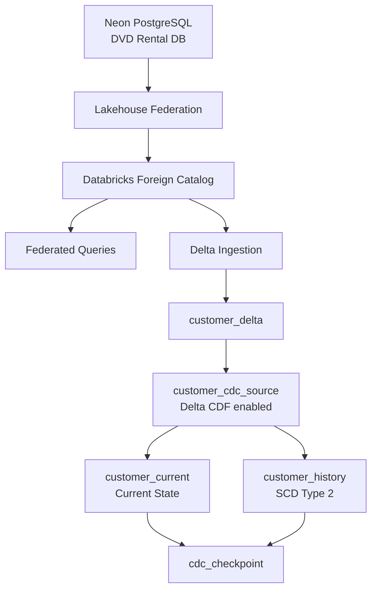
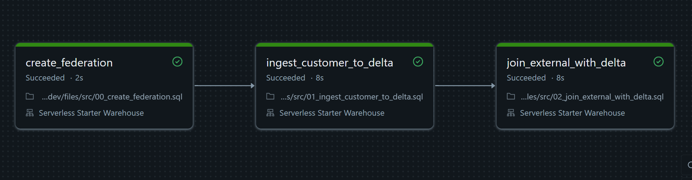
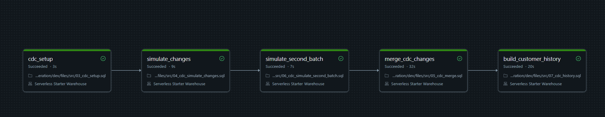

# LAB 10: External Operational Databases (Lakehouse Federation and CDC)

## Overview

This lab shows two ways to work with operational databases from Databricks:

1. **Lakehouse Federation**: query an external PostgreSQL database without copying the data first.
2. **Change Data Capture (CDC)** using Delta Change Data Feed (CDF): process inserts updates and deletes little by little instead of all at once.

The external source is a PostgreSQL database on Neon based on the DVD Rental sample database.

The project uses Databricks Asset Bundles with separate DEV and PROD settings.

## Architecture



## Project Structure

```
lakehouse_federation/
│
├── databricks.yml
├── README.md
├── .gitignore
│
├── docs/
│   └── images/
│       ├── federation_result.png
│       └── cdc_pipeline.png
│
├── resources/
│   ├── federation_setup_job.yml
│   └── cdc_job.yml
│
└── src/
    ├── 00_create_federation.sql
    ├── 01_ingest_customer_to_delta.sql
    ├── 02_join_external_with_delta.sql
    ├── 03_cdc_setup.sql
    ├── 04_cdc_simulate_changes.sql
    ├── 05_cdc_merge.sql
    ├── 06_cdc_simulate_second_batch.sql
    └── 07_cdc_history.sql
```

## Prerequisites

Before you run this project you need:

- Databricks CLI v0.220 or later set up with a profile that can access the target workspace (`databricks auth login`).
- Unity Catalog permissions to create connections and foreign catalogs in the metastore.
- Access to the Neon PostgreSQL DVD Rental database (host port database name username password).
- A Databricks workspace where you can create secret scopes.

### Create the secret scope

Database credentials are not saved in the repository. They are kept in a Databricks secret scope called `neon`. Create it first:

```bash
databricks secrets create-scope neon

databricks secrets put-secret neon username
databricks secrets put-secret neon password
```

## Part A: Lakehouse Federation

### External Source

The source is a PostgreSQL database hosted on Neon. The DVD Rental sample database has tables like:

`customer` `payment` `rental` `film` `inventory` `actor` `address` `city` `country`

Databricks reads these tables through Lakehouse Federation.

### Federation Setup

The project creates federation objects for each environment:

| Environment | Connection | Foreign catalog |
|---|---|---|
| DEV | `neon_dev_connection` | `neon_dvdrental_dev` |
| PROD | `neon_prod_connection` | `neon_dvdrental_prod` |

Database credentials live in a Databricks secret scope:

- **Scope:** `neon`
- **Keys:** `username` and `password`

No database password is saved in the repository.

The connection uses the PostgreSQL federation connector. The foreign catalog shows the external PostgreSQL metadata inside Unity Catalog.

### Querying Federated Data

Once the foreign catalog exists you can query PostgreSQL tables directly from Databricks without copying the data to Delta Lake first.

```sql
SELECT *
FROM neon_dvdrental_dev.public.customer
LIMIT 20;
```

The data stays in the external PostgreSQL database.

### Successful DEV Federation Job



The DEV federation workflow finished all three tasks without errors:

```
create_federation
        |
        v
ingest_customer_to_delta
        |
        v
join_external_with_delta
```

### Delta Ingestion

To compare federation with ingestion the external `customer` table is copied into a Delta table called `customer_delta`.

This gives a local copy of the customer data that we can use for analytics.

```
PostgreSQL
    |
    +------ Federation ------> Query data in place
    |
    +------ Ingestion -------> customer_delta
```

### Federated and Delta Join

The project also shows a query that mixes local Delta data with external federated data. Customer information comes from the Delta table (`customer_delta`). Payment information comes from the federated PostgreSQL source.

Example:

```sql
SELECT
    c.customer_id,
    c.first_name,
    c.last_name,
    COUNT(p.payment_id) AS payment_count,
    ROUND(SUM(p.amount), 2) AS total_spent
FROM customer_delta AS c
JOIN federated_payment AS p
    ON c.customer_id = p.customer_id
GROUP BY
    c.customer_id,
    c.first_name,
    c.last_name;
```

This shows that federated data and Delta Lake data can work together in the same query.

### Federation vs Ingestion

Federation is good when you need to query operational data without keeping another copy of it.

| | Good for | Downsides |
|---|---|---|
| **Federation** | Data stays in the source system. No ingestion pipeline needed for every table. Queries can get fairly fresh data. Access is controlled through Unity Catalog. | Query speed depends on the source database and the network. Analytical queries can put load on the operational database. Performance depends on the source and on query pushdown. Federated queries need the source to be available. |
| **Ingestion** | Better performance for queries you run often. You can use Delta Lake features and optimizations. Analytics workloads do not touch the operational database. You can build history and CDC patterns locally. | You keep an extra copy of the data. You need a way to keep it in sync. Freshness depends on how often you ingest or on the CDC process. |

## Part B: Change Data Capture

### CDC Source

The CDC source is `customer_cdc_source`. It is a Delta table with Change Data Feed turned on:

```sql
TBLPROPERTIES (
    delta.enableChangeDataFeed = true
)
```

Delta CDF adds change metadata like `_change_type` `_commit_version` and `_commit_timestamp`.

The change types we care about are `insert` `update_preimage` `update_postimage` and `delete`.

### Simulated CDC Events

The lab simulates two batches of changes.

**Batch 1**
- INSERT: Daniel Miller (customer_id 1001)
- UPDATE: Mary Smith (customer_id 1)
- DELETE: Patricia Johnson (customer_id 2)

**Batch 2**
- INSERT: Emma Wilson (customer_id 1002)
- UPDATE: Linda Williams (customer_id 3)
- DELETE: Barbara Jones (customer_id 4)

The simulation scripts are idempotent. If you run the workflow again it will not create the same changes twice.

### Incremental Current-State Processing

The table `customer_current` holds the latest state of each customer.

The pipeline reads the Delta Change Data Feed and only looks at commit versions newer than the saved checkpoint. For current-state processing:

| CDF change type | Action |
|---|---|
| `insert` | INSERT |
| `update_postimage` | UPDATE |
| `delete` | DELETE |
| `update_preimage` | ignored |

A `ROW_NUMBER()` step picks the latest event for each customer before the `MERGE` runs. This works well here because we only care about the latest state.

### CDC Checkpoint

The table `cdc_checkpoint` controls incremental processing. It has separate checkpoints for the current-state consumer and the history consumer.

After a successful DEV run:

| pipeline_name | last_processed_version |
|---|---|
| customer_cdc | 6 |
| customer_history | 6 |

> **Note:** the `pipeline_name` values (`customer_cdc` and `customer_history`) point to the two CDC consumers not to individual tables. This is why each consumer can move forward at its own pace even though both read from the same source (`customer_cdc_source`).

### Slowly Changing Dimension Type 2

Customer history is stored in `customer_history` with these columns:

`customer_id` `first_name` `last_name` `email` `active` `valid_from` `valid_to` `is_current` and `source_commit_version`

When a customer is **updated** the old current row is closed (`valid_to` = update time and `is_current` = false) and a new row is added (`valid_from` = update time `valid_to` = NULL and `is_current` = true).

When a customer is **deleted** the current history row is closed and no new row is added.

### CDC Pipeline

The CDC Databricks job runs five tasks:

```
cdc_setup
     |
     v
simulate_changes
     |
     v
simulate_second_batch
     |
     v
merge_cdc_changes
     |
     v
build_customer_history
```

### Successful DEV Execution



All five CDC tasks finished without errors in DEV.

### Validation

The CDC workflow was run again after the first successful run to check that it is idempotent.

The checkpoints stayed the same:

| pipeline_name | last_processed_version |
|---|---|
| customer_cdc | 6 |
| customer_history | 6 |

The current-state table (`customer_current`) had **599 rows**. The number of current SCD Type 2 records was also **599 rows**.

Some history results:

| customer_id | history_versions |
|---|---|
| 1 | 2 |
| 2 | 1 |
| 3 | 2 |
| 4 | 1 |
| 1001 | 1 |
| 1002 | 1 |

This confirms that running the pipeline again does not duplicate events that were already processed.

### Batch vs CDC

Regular batch ingestion reloads a full dataset or a big part of it on a schedule:

```
Source
   |
   | full / partial snapshot
   v
Target
```

CDC processes changes as they happen:

```
Source
   |
   | INSERT / UPDATE / DELETE
   v
Change Feed
   |
   v
Target
```

CDC moves less data and can reduce processing delay because it keeps the target table in sync step by step. But it also needs extra work like checkpoints event ordering idempotency retention and recovery.

### Late-Arriving Data

Delta CDF orders changes using `_commit_version` and `_commit_timestamp`. These tell us when a change was committed to Delta.

In a real production system the business event time can be different from the commit time. Events that arrive late may need an extra "effective timestamp" field and some logic to fix the SCD Type 2 date ranges.

This lab uses Delta commit order because the goal here is just to show CDC and SCD concepts with simple controlled changes.

## Security Considerations

Database credentials are stored in Databricks secrets not in the code. Unity Catalog controls who can use the federation connection and the foreign catalog.

A real production setup should also use:

- Database users with least privilege
- Unity Catalog permissions
- Encrypted network connections
- Limited access to secret scopes
- Different credentials per environment

Ingestion adds one more thing to think about for security because it creates another copy of the operational data that also needs to be protected.

## Databricks Asset Bundle

The project uses Databricks Asset Bundles to manage settings and job deployment for two targets: `dev` and `prod`.

| Target | Catalog | Schema |
|---|---|---|
| DEV | `dbr_dev` | `lakehouse_federation` |
| PROD | `dbr_prod` | `lakehouse_federation` |

The CDC SQL scripts use parameters for catalog and schema like this:

```sql
USE CATALOG IDENTIFIER(:catalog);
USE SCHEMA IDENTIFIER(:schema);
```

This means the same SQL files work for both DEV and PROD instead of keeping two versions. The federation setup also gets its settings from the bundle the same way so one project structure works for both targets.


## Running the Project

```bash
# Validate DEV
databricks bundle validate -t dev

# Deploy DEV
databricks bundle deploy -t dev

# Run Federation in DEV
databricks bundle run federation_setup -t dev

# Run CDC in DEV
databricks bundle run cdc_pipeline -t dev

# Validate PROD
databricks bundle validate -t prod --profile prod
```

Only run the PROD deployment after you have approval.

## Lab Requirements

This project covers the LAB 10 requirements:

- [x] Lakehouse Federation set up with PostgreSQL
- [x] Foreign catalog created
- [x] External PostgreSQL tables queried from Databricks
- [x] External data ingested into Delta for comparison
- [x] Federated data joined with Delta data
- [x] Delta Change Data Feed enabled
- [x] INSERT events captured
- [x] UPDATE events captured
- [x] DELETE events captured
- [x] Incremental processing implemented
- [x] MERGE INTO used for current-state sync
- [x] Checkpointing implemented
- [x] SCD Type 2 history implemented
- [x] Multiple CDC batches processed
- [x] Idempotent reruns validated
- [x] Separate DEV and PROD bundle targets set up

## Conclusion

This lab shows why federation and ingestion work well together instead of competing. Lakehouse Federation gives direct access to operational data when you do not need a copy. Delta ingestion gives a better base for regular analytics CDC processing and history tracking.

Delta Change Data Feed gives the change events needed to keep a current-state Delta table in sync and to build SCD Type 2 history without reprocessing the whole source dataset every time.