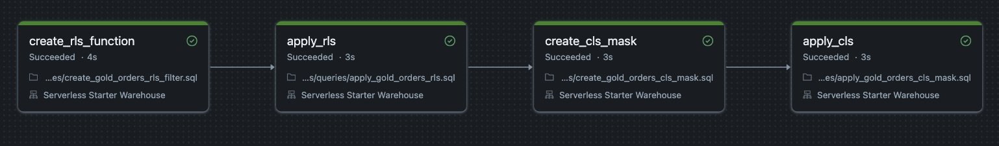
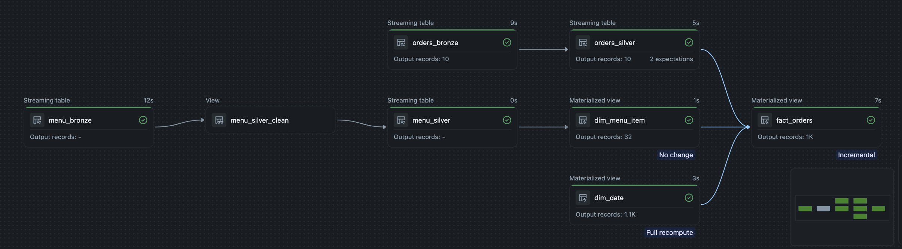

# Data Engineering Pipeline — Lakeflow Declarative Pipelines

A medallion-architecture (Bronze → Silver → Gold) data pipeline built on Azure Databricks with Unity Catalog using Lakeflow Declarative Pipelines and deployed via Databricks Asset Bundles and GitHub Actions.

**Domain:** order and menu analytics sourced from a Kafka (Confluent Cloud) events stream and a CSV menu catalog.

> **Note on structure:** Labs 5 and 6 live in the same `lab_5/` project rather than in separate folders. Bronze → Silver → Gold is a single continuous pipeline, not independent projects. Lab 6 extends the Lab 5 pipeline with a new `gold/` transformation folder, new bundle resources (dashboard, alert, governance job), and CI/CD updates, all on top of the existing Bronze/Silver code. Duplicating the folder for Lab 6 would have meant two copies of the same Bronze/Silver logic drifting out of sync over time; Git branching (`feature/lab-6-gold`) provides the versioning a separate folder would otherwise be trying to achieve.

---

## Table of contents

- [Architecture](#architecture)
- [Repository structure](#repository-structure)
- [Tech stack](#tech-stack)
- [Bronze & Silver layers](#bronze--silver-layers)
- [Gold layer — star schema](#gold-layer--star-schema)
- [AI/BI dashboard](#aibi-dashboard)
- [Alerting](#alerting)
- [Governance — row and column-level security](#governance--row-and-column-level-security)
- [CI/CD & automation](#cicd--automation)
- [Screenshots](#screenshots)

---

## Architecture

```
Kafka (Confluent) ──▶ orders_bronze ──▶ orders_silver ─────────┐
                                                                 ├──▶ fact_orders ──▶ AI/BI Dashboard
CSV (menu)  ──▶ menu_bronze ──▶ menu_silver_clean ──▶ menu_silver (SCD2) ──▶ dim_menu_item ─┤
                                                                dim_date ────────────────────┘
```

Bronze and Silver ingest incrementally: Auto Loader for the CSV source, and Structured Streaming for Kafka. Gold builds a star schema on top of Silver and feeds a governed AI/BI dashboard.

## Repository structure

```
lab_5/
├── databricks.yml            # Bundle definition, targets (dev/prod), variables
├── resources/                 # Pipeline, jobs, schemas, alert, and governance job definitions
├── queries/                   # RLS/CLS SQL: function definitions and ALTER statements
├── src/
│   ├── transformations/
│   │   ├── bronze/
│   │   ├── silver/
│   │   └── gold/               # dim_date, dim_menu_item, fact_orders
│   ├── dashboard/               # AI/BI dashboard definition (.lvdash.json)
│   └── producer/                # Kafka test-event generator
└── scripts/                     # CI/CD automation (pipeline trigger, governance job trigger)
```

## Tech stack

| Layer | Technology |
|---|---|
| Compute & orchestration | Azure Databricks, Lakeflow Declarative Pipelines |
| Governance | Unity Catalog (RLS, CLS, grants) |
| Streaming source | Confluent Cloud (Kafka) |
| Deployment | Databricks Asset Bundles (DABs) |
| CI/CD | GitHub Actions |
| BI | Databricks AI/BI Dashboards |

## Bronze & Silver layers

- **Bronze**: incremental ingestion, using Auto Loader for the menu CSV and Structured Streaming for the Kafka orders topic.
- **Silver**: cleaned and validated with declarative data quality expectations (`expect_or_drop`). The menu dimension is maintained as a full SCD Type 2 history via `create_auto_cdc_flow`.

## Gold layer — star schema

| Table | Type | Description |
|---|---|---|
| `dim_date` | Dimension | Generated calendar with a configurable date range |
| `dim_menu_item` | Dimension | Current snapshot of the SCD2 menu table |
| `fact_orders` | Fact | One row per order line, with foreign keys to both dimensions |

## AI/BI dashboard

A single page dashboard over `fact_orders`: order, revenue, units, and AOV counters; a revenue trend over time; category and item breakdowns; and filters for date range, category, and menu item. Published with **individual data permissions**, so row and column level security is enforced per viewer rather than under the publisher's credentials.

## Alerting

A scheduled SQL alert checks order volume in `orders_silver` over a rolling 24 hour window and sends an email notification if it drops to zero, catching ingestion issues close to the source, before they propagate into Gold.

## Governance — row and column-level security

Two SQL user defined functions are applied to `fact_orders`:

- **Row filter**: restricts visible `item_id`s based on `current_user()`.
- **Column mask**: hides `discount_code` from all but the data owner.

Both are created and applied by a dedicated `gold_governance_job` (four sequential SQL tasks). Because `fact_orders` is a materialized view, the masks are applied with `ALTER MATERIALIZED VIEW ... SET ROW FILTER / SET MASK`, rather than the plain table `ALTER TABLE` syntax.

## CI/CD & automation

A GitHub Actions workflow validates, deploys, and operates the pipeline across two environments:

| Job | Trigger | Behavior |
|---|---|---|
| `validate` | Pull request into `main` | Validates the bundle |
| `deploy-dev` | Push to `feature/lab-6-gold` | Deploys the bundle, then triggers the pipeline and the governance job |
| `deploy-prod` | Tag `lab6-v*` | Deploys the bundle to production |
| `run-prod-automation` | Manual (`workflow_dispatch`) | Triggers the pipeline and governance job in production, gated behind an explicit approval checkbox |

Pipeline and job execution are driven by two Python scripts (`scripts/trigger_pipeline.py`, `scripts/databricks_automation.py`) using the Databricks SDK, which trigger the target resource and poll it to a terminal state, surfacing failures directly in the workflow run. Production execution is intentionally decoupled from the automatic deploy, so code ships continuously while data and governance changes require a manual go ahead.

## Screenshots

**Governance job**: the four SQL tasks that create and apply the row filter and column mask on `fact_orders`.



**Gold layer pipeline run**: `dim_date`, `dim_menu_item`, and `fact_orders` completing successfully.

